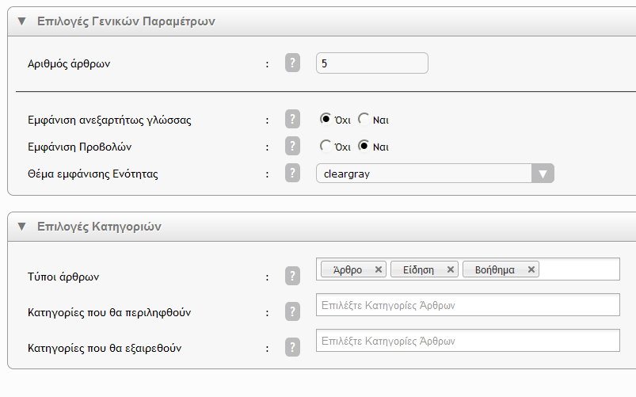

***

# Πώς να χρησιμοποιήσετε το block `article_author_more` του Ascoos Cms.

Αυτό το σεμινάριο χωρίζεται σε τρία βήματα.
1) Εγκατάσταση του block «`background_selector`».
2) Επεξεργασία και διαμόρφωση των παραμέτρων του.
3) Το αποτέλεσμα που έχουμε.

***

# Εγκατάσταση

Το πρώτο βήμα είναι να εγκαταστήσουμε το Block στην **Ascoos Cms** ιστοσελίδα που έχουμε.

Το Block εγκαθίσταται μόνο μέσω του ενσωματωμένου προγράμματος εγκατάστασης στο τμήμα διαχείρισης.

Από την επιφάνεια εργασίας του **Ascoos Cms**, επιλέγουμε με διπλό κλικ το εικονίδιο `Installation Program` που βλέπετε στην παρακάτω εικόνα.

Αυτό θα μας ανοίξει το πρόγραμμα εγκατάστασης, στο οποίο θα πρέπει να ακολουθήσουμε ορισμένα εύκολα βήματα για να ολοκληρώσουμε την εγκατάσταση του block μας.

### Welcome
Αρχικά το πρόγραμμα μας καλοσωρίζει στο πρόγραμμα εγκατάστασης, δίνοντας μας μερικές πληροφορίες γι' αυτό και την διαδικασία εγκατάστασης.

### Action Selection
Εδω επιλέγουμε τα δύο βήματα ενέργειας του προγράμματος εγκατάστασης.
- Στο πρώτο βήμα επιλέγουμε το action `Install` δηλώνοντας έτσι στο πρόγραμμα εγκατάστασης ότι θα κάνουμε `νέα εγκατάσταση`. Σε περίπτωση που το block μας είναι ήδη εγκατεστημένο και απλώς θέλουμε να το αναβαθμίσουμε τότε θα επιλέξουμε το `Extension Upgrade`.
Σε περίπτωση που θέλουμε να απεγκαταστήσουμε ένα συστατικό τότε θα επιλέξουμε το `Unistall`.
Η πρώτη επιλογή `ASCOOS Upgrade` είναι για την αναβάθμιση έκδοσης του πυρήνα.

- Στο δεύτερο βήμα ενέργειας, επιλέγουμε τον τύπο της επέκτασής μας.
Στην περίπτωσή μας εδώ, επιλέγουμε `Blocks`.

Στη συνέχεια πατάμε το πλήκτρο `Next` για να συνεχίσουμε παρακάτω με την διαδικασία εγκατάστασης.

### Select installation package
Εδώ μας ζητείται να επιλέξουμε από τον υπολογιστή μας το συμπιεσμένο αρχείο (zip file) που περιέχει το πακέτο εγκατάστασης.

Το πρόγραμμα μας ενημερώνει επίσης, ότι το πακέτο εγκατάστασης θα πρέπει να είναι πιστοποιημένο από την AlexSoft Software ώστε να έχει όλες τις απαραίτητες δικλείδες ασφαλείας για το σύστημά σας.

Πατάμε `Next` και εφόσον στην συγκεκριμμένη περίπτωση δεν έχουμε παραμέτρους που πρέπει να ρυθμιστούν κατά την διαδικασία εγκατάστασης, το πρόγραμμα θα ολοκληρώσει την εγκατάσταση.

Θα πατήσουμε στο τέλος το πλήκτρο `Close` και θα ολοκληρώσουμε την εργασία μας με το πρόγραμμα εγκατάστασης.

***

# Επεξεργασία και παραμετροποίηση του Block

Στην επιφάνεια εργασίας του **Ascoos Cms** επιλέγουμε με διπλό κλικ το εικονίδιο `ASCOOS Explorer` ώστε να ανοίξουμε το πρόγραμμα διαχείρισης των συστατικών του Ascoos.

Στο πρόγραμμα που θα μας ανοίξει (βλέπε εικόνα παρακάτω) επιλέγουμε :
1) Από την κορδέλα μενού το tab `Blocks` ώστε να μεταβούμε στη σελίδα διαχείρισης των Blocks.

2) πηγαίνουμε στο τμήμα `Views` και από το drop-down με την ονομασία `Block` επιλέγουμε το `article_author_more`. Αυτό θα μας εμφανίσει στην λίστα των blocks μόνο το block με τίτλο `More Author Articles`.
3) Στην εμφανιζόμενη λίστα κάνουμε κλικ στο `More Author Articles` ώστε να ανοίξουμε για επεξεργασία το block μας.

***

## 1. Επεξεργασία των βασικών ιδιοτήτων του Block.

Όλα τα Blocks στο Ascoos Cms έχουν εξ αρχής τις βασικές τους ρυθμίσεις ίδιες.

Από την σελίδα επεξεργασίας των βασικών ρυθμίσεων μπορούμε να προσαρμόσουμε στις ιδιαίτερες ανάγκες του κάθε block αν και το αρχείο istall.php του πακέτου εγκατάστασης του block μας, φροντίζει να προρυθμίσει αυτές τις ιδιαιτερότητες όπως βλέπετε και στην παρακάτω εικόνα.

### Αλλά ας αναλύσουμε ένα-ένα τα κομμάτια αυτά των βασικών ρυθμίσεων.

1. `BLOCK NAME` : Εδώ δίνουμε την ονομασία που θα έχει το block μας. Εκτός από γράμματα και αριθμούς μπορούμε να χρησιμοποιήσουμε και τους χαρακτήρες παύλα `-` και κάτω παύλα `_`.
    - `Block Name` : είναι στην ουσία το όνομα του αντιγράφου του φυσικού block. 
    - `Natural Block Name` : Είναι το φυσικό όνομα του block όπως αυτό βρίσκεται στον δίσκο του server. Μπορούμε να δημιουργήσουμε όσα αντίγραφα του block επιθυμούμε. Φυσικά το κάθε ένα θα έχει και διαφορετική ονομασία.

2. `BLOCK TITLE` : Εδώ μπορούμε να δώσουμε πολύγλωσσους τίτλους στο block μας. Φυσικά μπορούμε μόνο στις γλώσσες που υποστηρίζει η ιστοσελίδα μας. Μπορούμε να προσθέσουμε, να αφαιρέσουμε και να ταξινομήσουμε τους τίτλους όπως επιθυμούμε.

3. `VIEW OPTIONS` : Εδώ ορίζουμε τις παραμέτρους εμφάνισης του block.
    
    - `Envirenment` : Το περιβάλλον που θα εμφανιστεί. π.χ. στην παρακάτω εικόνα, του λέμε να εμφανιστεί στο προσκήνιο της ιστοσελίδας. Θα μπορούσε να οριστεί για εμφάνιση στο τμήμα διαχείρισης, στο ενημερωτικό δελτίο κλπ.
    
    - `3LT Template (Front)` : Κάθε Ascoos Template αποτελείται από 3 επίπεδα, τα `front`, `frontpage` και `efp (encapsulation frontpage)`. 
    Το `front` αποτελεί το κύριο μέρος του template και δεν αλλάζει. 
    Μέσα αυτό μπορούν να εμφανιστούν τα δύο άλλα επίπεδα που αναφέρονται παρακάτω, αλλά μόνο ένα `frontpage`. Ενώ μπορούμε να ενσωματώσουμε πολλά `efp`. 
    Με την τεχνολογία του 3LT Template, το `Ascoos Cms`, δίνει την δυνατότητα προσαρμογής από σελίδα σε σελίδα, από άρθρο σε άρθρο κλπ, χωρίς να αλλάξει το βασικό μας οπτικό μέρος.
    
    - `3LT Template (Frontpage)`: Το 2ο επίπεδο του template μας. Μπορεί να περιέχει μεμονωμένο κώδικα (όπως `native blocks`), να περιέχει όσα `efp` θέλουμε αλλά δεν μπορεί να περιέχει άλλο `frontpage` ή `front`.
    
    - `3LT Template (EFP)` : Το 3ο επιπεδο του template. μπορεί να ενσωματωθεί στα δύο προηγούμενα όσες φορές θέλουμε. 
    `ΠΡΟΣΟΧΗ - BONUS` : Ο συνδυασμός των τριών επιπέδων μπορεί να δώσει τεράστια ευελιξία στην εμφάνιση των συστατικών μας. Π.χ. δημιουργούμε δύο αντίγραφα του block με διαφορετικές ρυθμίσεις και παραμέτρους και ενώ η θέση εμφάνισης είναι ίδια, εάν το frontpage είναι διαφορετικό, θα έχουμε εμφάνιση μόνο του ενός block, ενώ το άλλο block θα εμφανιστεί στο frontpage που του ορίσαμε, όταν η σελίδα θα περιέχει το frontpage.
    Π.χ. στο πρόγραμμα `articles` ορίζουμε άλλο `frontpage` και στο πρόγραμμα `contacts` άλλο, αλλά και τα δύο έχουν θέσεις εμφάνισης π.χ. το "position1". Αναλόγως ποιο `frontpage` ή `efp` ορίζουμε στις ρυθμίσεις του block μας θα εμφανιστεί και το ανάλογο.
    
    - `View Position` : Η θέση εμφάνισης του block. Κάθε μέρος των 3LT Templates μπορεί να έχει διαφορετικές θέσεις εμφάνισης. Αυτές συνήθως δημιουργούνται κατά την διαδικασία εγκατάστασης του template, αλλά μπορούν να δημιουργηθούν και αργότερα.

    - `View Order` : Η σειρά που θα εμφανιστεί μέσα στο `View Position`.

4. `BLOCK PROPERTIES` : 

    - `A/A` : Auto Increment number. Δημιουργείται από την βάση δεδομένων.

    - `User Group` : Το ελάχιστο επίπεδο πρόσβασης ομάδας του χρήστη.

    - `Puplished` : Είναι δημοσιευμένο;

    - `Show Title` : Θα μφανιστεί ο τίτλος του block;

    - `Cache` : Να συμπεριληφθεί ο τελικός κώδικας του block στην προσωρινή μνήμη;

    - `Cache Duration` : Κάθε πόσα δευτερόλεπτα θα ανανεώνονται τα δεδομένα στην `Cache`.

5. `COMMENTS ON BLOCK` : περιλαμβάνει διάφορα σχόλια του χρήστη που θέλει να έχει για το block.

***

## 2. Δικαιώματα πρόσβασης

Ο τρόπος λειτουργίας των δικαιωμάτων πρόσβασης, όχι μόνο για τα blocks αλλά και για όλα τα συστατικά του **Ascoos Cms** περιγράφεται στο βίντεο 
[Ascoos Cms Blocks - Edit Permissions](https://www.youtube.com/watch?v=nqgJp10iquw) που υπάρχει στο youtube.

***

## 3. Επεξεργασία των ειδικών παραμέτρων του Block.
Κάθε συστατικό του **Ascoos Cms** έχει και τις ιδιαίτερες παραμέτρους λειτουργίας του. για το συγκεκριμμένο block είναι αυτές που φαίνονται στην ακόλουθη εικόνα. 

1) `General Configuration Options` : 
    
    - `Number of articles` : Εδώ πρέπει να επιλέξετε τον αριθμό των άρθρων που θα εμφανιστούν.

    - `Showing regardless of language` : Θέλετε να περιληφθούν όλα τα άρθρα, ανεξάρτητα από την γλώσσα που συντάχθηκαν; Αυτό θα έχει ως αποτέλεσμα να εμφανιστούν όλα τα άρθρα ανεξάρτητα από την γλώσσα σύνταξης τους. Για καλύτερη ενημέρωση στα αριστερά θα εμφανίζεται μια σημαία για να προσδιορίζει την γλώσσα σύνταξης.

    - `Appearance of Projections` : Θέλετε να εμφανίζεται στήλη με τις συνολικές προβολές του περιεχομένου;

    - `Theme of appearance of Block` : Επιλέξτε το θέμα εμφάνισης που θα υλοποιηθεί το Block. Κάθε ενότητα έχει τουλάχιστο το προκαθορισμένο θέμα εμφάνισης με την ονομασία &laquo;default&raquo;.

2) `Choices of Categories` :

      - `Types of Articles` : Ποιοι τύποι άρθρων θέλετε να συμπεριληφθούν; Αυτό θα έχει ως αποτέλεσμα την εμφάνιση μόνο των άρθρων που έχουν ώς τύπο έναν από τους οριζόμενους.

      - `Categories that will be included` : Ποιες κατηγορίες θέλετε να περιληφθούν; Αυτό θα έχει ως αποτέλεσμα μόνο τα άρθρα που έχουν μια από τις κατηγορίες αυτές να εμφανιστούν στην λίστα των άρθρων του συγγραφέα.

      - `Categories to be excluded` : Ποιες κατηγορίες θέλετε να εξαιρεθούν; Αυτό θα έχει ως αποτέλεσμα να παρακαμφθούν όλα τα άρθρα που ανήκουν στις κατηγορίες αυτές. Η επιλογή αυτή αναιρεί την κατηγορία από την παραπάνω παράμετρο (περιλαμβανόμενες κατηγορίες), εάν δοθεί και σε αυτή.

***

# Το αποτέλεσμα
Στο τέλος επιλέγουμε το πλήκτρο `Save` από το μενού ενεργείων και πηγαίνουμε στο frontend της σελίδας μας για να δούμε τα αποτελέσματα.

Ως Administrator έχουμε την δυνατότητα να δούμε πλήρως λειτουργική την ισοσελίδα μας, ακόμη και αν στοιχεία αυτής είναι δεσμευμένα για δημοσίευση σε μεταγενέστερο χρόνο.

Από τις ρυθμίσεις που βλέπουμε στις διάφορες εικόνες παραπάνω θα έχουμε ένα αποτέλεσμα στην σελίδα μας όπως το παρακάτω.

Με την επιλογή του θέματος `default` :

Με την επιλογή του θέματος `cleargray` :

Εάν επιλέξουμε ένα άρθρο που δεν υπάρχει στην τρέχουσα γλώσσα της σελίδας, τότε εμφανίζετε ένα μήνυμα σφάλματος, προτρέποντας μας να επιλέξουμε το άρθρο σε κάποια άλλη γλώσσα:

